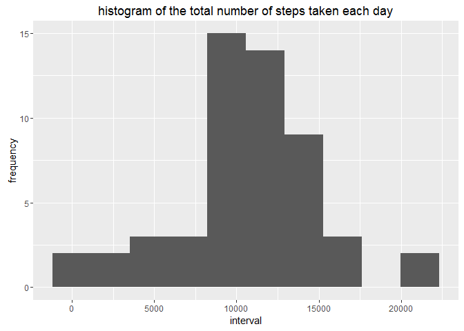
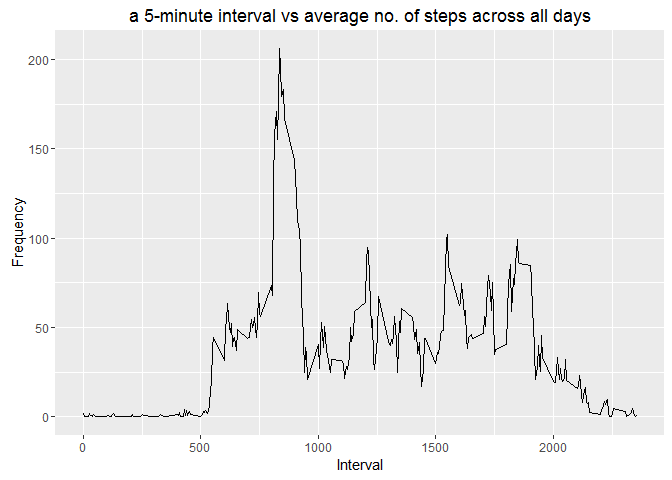
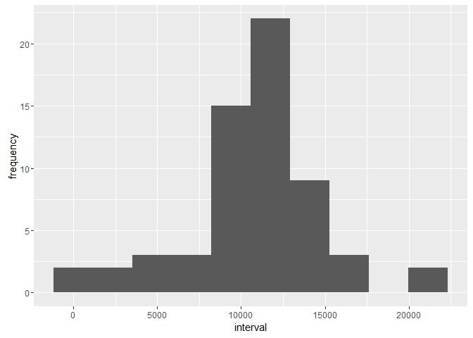
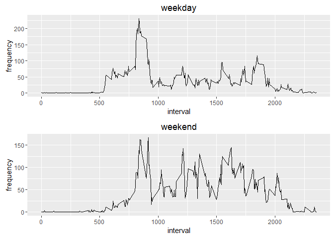

# Reproducible Research: Peer Assessment 1


## Loading and preprocessing the data


```r
# load needed libraries
suppressMessages(library(ggplot2))
suppressMessages(library(tidyr))
suppressMessages(library(dplyr))
suppressMessages(library(gridExtra))

# Read in the Data
act_data = read.csv('activity.csv')

# glimpse on the data, str
str(act_data)
```

```
## 'data.frame':	17568 obs. of  3 variables:
##  $ steps   : int  NA NA NA NA NA NA NA NA NA NA ...
##  $ date    : Factor w/ 61 levels "2012-10-01","2012-10-02",..: 1 1 1 1 1 1 1 1 1 1 ...
##  $ interval: int  0 5 10 15 20 25 30 35 40 45 ...
```

```r
# glimpse on the data, head
head(act_data)
```

```
##   steps       date interval
## 1    NA 2012-10-01        0
## 2    NA 2012-10-01        5
## 3    NA 2012-10-01       10
## 4    NA 2012-10-01       15
## 5    NA 2012-10-01       20
## 6    NA 2012-10-01       25
```

```r
# glimpse on the data, tail
tail(act_data)
```

```
##       steps       date interval
## 17563    NA 2012-11-30     2330
## 17564    NA 2012-11-30     2335
## 17565    NA 2012-11-30     2340
## 17566    NA 2012-11-30     2345
## 17567    NA 2012-11-30     2350
## 17568    NA 2012-11-30     2355
```


## What is mean total number of steps taken per day?

Calculate the total number of steps taken per day


```r
# calculate the total number of steps taken per day
total_steps_per_day = subset(act_data, !is.na(steps)) %>% 
    group_by(date) %>%
    summarise(total_per_day = sum(steps))

total_steps_per_day
```

```
## # A tibble: 53 × 2
##          date total_per_day
##        <fctr>         <int>
## 1  2012-10-02           126
## 2  2012-10-03         11352
## 3  2012-10-04         12116
## 4  2012-10-05         13294
## 5  2012-10-06         15420
## 6  2012-10-07         11015
## 7  2012-10-09         12811
## 8  2012-10-10          9900
## 9  2012-10-11         10304
## 10 2012-10-12         17382
## # ... with 43 more rows
```

```r
#overall total
sum(total_steps_per_day$total_per_day)
```

```
## [1] 570608
```

If you do not understand the difference between a histogram and a barplot, research the difference between them. Make a histogram of the total number of steps taken each day


```r
# plotting the histogram of the steps
ggplot(data=total_steps_per_day, aes(total_per_day))+
    geom_histogram(bins=10)+
    xlab('interval')+
    ylab('frequency')+
    ggtitle('histogram of the total number of steps taken each day')
```

<!-- -->

Calculate and report the mean and median of the total number of steps taken per day


```r
# calculate the mean and the median of steps taken per day
mean_median_steps_by_dy = subset(act_data, !is.na(steps)) %>%
    group_by(date) %>%
    summarise(mean = mean(steps),
              median= median(steps))

mean_median_steps_by_dy
```

```
## # A tibble: 53 × 3
##          date     mean median
##        <fctr>    <dbl>  <dbl>
## 1  2012-10-02  0.43750      0
## 2  2012-10-03 39.41667      0
## 3  2012-10-04 42.06944      0
## 4  2012-10-05 46.15972      0
## 5  2012-10-06 53.54167      0
## 6  2012-10-07 38.24653      0
## 7  2012-10-09 44.48264      0
## 8  2012-10-10 34.37500      0
## 9  2012-10-11 35.77778      0
## 10 2012-10-12 60.35417      0
## # ... with 43 more rows
```

```r
# the overall mean 
mean(total_steps_per_day$total_per_day)
```

```
## [1] 10766.19
```

```r
# the overall median
median(total_steps_per_day$total_per_day)
```

```
## [1] 10765
```


## What is the average daily activity pattern?

Make a time series plot (i.e. type = "l") of the 5-minute interval (x-axis) and the average number of steps taken, averaged across all days (y-axis)


```r
# get a dataframe grouped by intervals and avg_steps per interval
avg_steps_by_inter = subset(act_data, !is.na(steps)) %>%
    group_by(interval) %>%
    summarise(avg_steps = mean(steps))

# plot the line graph
ggplot(aes(x=interval, y=avg_steps),
       data = avg_steps_by_inter)+
    geom_line()+
    xlab('Interval')+
    ylab('Frequency')+
    ggtitle('a 5-minute interval vs average no. of steps across all days')
```

<!-- -->

Which 5-minute interval, on average across all the days in the dataset, contains the maximum number of steps?


```r
# filter by the max average steps and get the corrospondant interval
max_interval = filter(avg_steps_by_inter, avg_steps == max(avg_steps))
max_interval$interval
```

```
## [1] 835
```

## Imputing missing values

Calculate and report the total number of missing values in the dataset (i.e. 
the total number of rows with NAs)


```r
total_NAs = sum(is.na(act_data))
total_NAs
```

```
## [1] 2304
```

Devise a strategy for filling in all of the missing values in the dataset. The strategy does not need to be sophisticated. For example, you could use the mean/median for that day, or the mean for that 5-minute interval, etc.

Create a new dataset that is equal to the original dataset but with the missing data filled in.


```r
# get the mean and median for the steps grouped by intervals
mean_median_steps_per_int = subset(act_data, !is.na(steps)) %>% 
    group_by(interval) %>%
    summarise(mean_per_int = mean(steps),
              median_per_int = median(steps))

act_data_noNAs = act_data

# impute steps with NAs with the average of that interval period
for (i in seq_along(act_data_noNAs$steps)){

    if ( is.na(act_data_noNAs$steps[i]) ){
            
        act_data_noNAs$steps[i] = filter(mean_median_steps_per_int, 
                                  interval == act_data_noNAs$interval[i])$mean_per_int
      
    }
}

# check that there is not any NAs
sum(is.na(act_data_noNAs))
```

```
## [1] 0
```

Make a histogram of the total number of steps taken each day and Calculate and report the mean and median total number of steps taken per day. Do these values differ from the estimates from the first part of the assignment? What is the impact of imputing missing data on the estimates of the total daily number of steps?


```r
summary_steps_per_day = act_data_noNAs %>% 
    group_by(date) %>%
    summarise(total_per_day = sum(steps),
              mean_per_day = mean(steps),
              median_per_day = median(steps))

summary_steps_per_day
```

```
## # A tibble: 61 × 4
##          date total_per_day mean_per_day median_per_day
##        <fctr>         <dbl>        <dbl>          <dbl>
## 1  2012-10-01      10766.19     37.38260       34.11321
## 2  2012-10-02        126.00      0.43750        0.00000
## 3  2012-10-03      11352.00     39.41667        0.00000
## 4  2012-10-04      12116.00     42.06944        0.00000
## 5  2012-10-05      13294.00     46.15972        0.00000
## 6  2012-10-06      15420.00     53.54167        0.00000
## 7  2012-10-07      11015.00     38.24653        0.00000
## 8  2012-10-08      10766.19     37.38260       34.11321
## 9  2012-10-09      12811.00     44.48264        0.00000
## 10 2012-10-10       9900.00     34.37500        0.00000
## # ... with 51 more rows
```

```r
ggplot(data = summary_steps_per_day, aes(total_per_day) ) +
    geom_histogram(bins=10)+
    xlab('interval')+
    ylab('frequency')
```

<!-- -->

```r
#overall total
sum(summary_steps_per_day$total_per_day)
```

```
## [1] 656737.5
```

```r
# the overall mean 
mean(summary_steps_per_day$total_per_day)
```

```
## [1] 10766.19
```

```r
# the overall median
median(summary_steps_per_day$total_per_day)
```

```
## [1] 10766.19
```

There is a difference when imputing missing data.

## Are there differences in activity patterns between weekdays and weekends?

Create a new factor variable in the dataset with two levels - "weekday" and "weekend" indicating whether a given date is a weekday or weekend day.


```r
# convert data to date format
act_data_noNAs$date= as.Date(act_data_noNAs$date)

# store the weekend days as vector
weekend = c('Saturday', 'Sunday')

# isolate the weekdays into the days var
days= weekdays(act_data_noNAs$date)
f_days = days

for (i in seq_along(days)){
    if (days[i] %in% weekend){
        f_days[i] = 'weekend'
    }else{
        f_days[i] = 'weekday'
    }
}

# convert to factor type
f_days = factor(f_days)

# add the f_days column into the DF
act_data_noNAs$day = f_days
```

Make a panel plot containing a time series plot (i.e. type = "l") of the 5-minute interval (x-axis) and the average number of steps taken, averaged across all weekday days or weekend days (y-axis). See the README file in the GitHub repository to see an example of what this plot should look like using simulated data.


```r
# get the average of steps by interval and days
avg_steps_by_inter_daytype = act_data_noNAs %>%
    group_by(interval,day) %>%
    summarise(avg_steps = mean(steps)) %>%
    ungroup()

#change from long to wide format
avg_steps_by_inter_daytype = spread(data=avg_steps_by_inter_daytype, day, avg_steps)

# plot the graphs
p_weekend = ggplot(aes(x=interval, y=weekend),
       data= avg_steps_by_inter_daytype)+
    geom_line()+
    xlab('interval')+
    ylab('frequency')+
    ggtitle('weekend')

p_weekday = ggplot(aes(x=interval, y=weekday),
       data= avg_steps_by_inter_daytype)+
    geom_line()+
    xlab('interval')+
    ylab('frequency')+
    ggtitle('weekday')

grid.arrange(p_weekday,p_weekend, ncol=1)
```

<!-- -->
